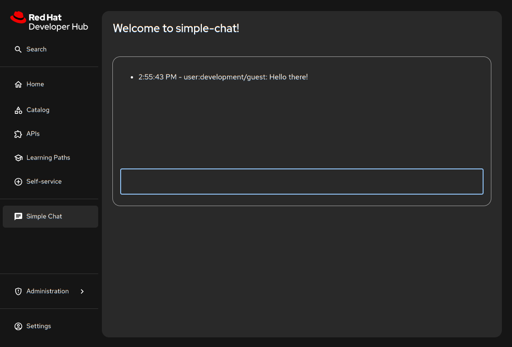

# Getting Started with Dynamic Plugins for Red Hat Developer Hub

This repository provides an up-to-date example for developing, building, and deploying dynamic plugins for Red Hat Developer Hub (Developer Hub). It demonstrates a complete workflow, from a local Backstage instance to a fully deployed dynamic plugin on an OpenShift cluster using modern tooling.

This guide assumes you have a foundational understanding of Backstage plugin development. For a general introduction to creating plugins, please refer to the official [Backstage documentation](https://backstage.io/docs/plugins/create-a-plugin).

## Compatibility

This project is aligned with **Red Hat Developer Hub 1.6**. When creating a new project from scratch, use the corresponding create-app version to ensure compatibility.

| **Developer Hub Version** | **Backstage Version** | **@backstage/create-app Version** |
| :--------------: | :-------------------: | :-------------------------------: |
| **1.6** | **1.36.1** | **0.6.12** |

## Prerequisites

Ensure the following tools are installed on your system:

- **Node.js**: ~20.x
- **Yarn**: ~4.x
- **oc**: The OpenShift CLI client.
- An active OpenShift cluster with an operator-based installation of Red Hat Developer Hub.
- Access to an OCI-compliant container registry (this guide will use the internal OpenShift registry).

## The Dynamic Plugin Workflow

Deploying a dynamic plugin involves a few key stages:

1. **Develop**: Create your frontend and backend plugins within a standard Backstage application.
2. **Package**: Use the `@red-hat-developer-hub/cli` tool to build and package the plugin either as an OCI artifact for a remote registry or as local files for testing.
3. **Push & Host**: The packaged OCI artifact is pushed to a container registry accessible to your Developer Hub instance.
4. **Configure**: Update your Developer Hub instance's configuration via a ConfigMap to instruct it to download and integrate your plugin from the registry.

### Step 1: Build the Plugins

First, ensure all dependencies are installed and the plugin source code is built.

```bash
# Install dependencies and build the project
yarn install
yarn tsc
yarn build
```

## Local Development and Testing

For the fastest development loop, you can export your plugins to a local directory and test them with different methods.

### Export Plugins for Local Testing

This initial step is the same for both local testing methods.

Export all plugins to the local deploy directory:

The --export-to flag will package all plugins in the workspace and place their assets in the specified directory. It's recommended to clean the deploy directory before exporting to ensure you don't have any stale artifacts.

```bash
# Clean the deployment directory
rm -rf ./dynamic-plugins-root/*

# Export all workspace plugins to the deploy directory
npx -y @red-hat-developer-hub/cli plugin package \
 --export-to ./dynamic-plugins-root
```

Now you can proceed with either method below.

#### Method 1: Using rhdh-local

Point `--export-to` to [rhdh-local's](https://github.com/redhat-developer/rhdh-local) "local-plugins" directory and update its dynamic-plugins.yaml using the suggested configuration created by the "plugin package" command.  Refer to the [rhdh-local documentation](https://github.com/redhat-developer/rhdh-local) for specific instructions.

#### Method 2: Using Podman Directly

You can run the Developer Hub container directly and mount your local plugins. This provides a quick feedback loop without needing [rhdh-local](https://github.com/redhat-developer/rhdh-local) or a full OpenShift deployment. This method uses the example `app-config.yaml` included in the root of this repository.

The supplied script starts the container, mounts the dynamic-plugins-root directory and the repository's `app-config.yaml`, and overrides the entrypoint to use the custom config.

```bash
./run-example.sh
```

Developer Hub will now be running and you can access the simple-chat plugin at <http://localhost:7007/simple-chat>.



## Deploying to OpenShift using Quay.io

This workflow packages your plugins as OCI artifacts and pushes them to a public `quay.io` repository. These instructions assume you have:

- A Quay.io account.
- Created a namespace called "rhdh" in your OpenShift cluster.
- Deployed Developer Hub to the "rhdh" namespace using the operator.

> **Note:** This guide uses a public Quay.io repository for simplicity. If you use a private repository, you must create an image pull secret in your OpenShift project and link it to the `backstage-backend` service account.

### Step 1: Package and Push Plugins to Quay.io

1. **Log in to Quay.io:**

    Use `podman` or `docker` to log in to your Quay.io account.

    ```bash
    podman login quay.io
    ```

2. **Package all plugins:**

    Run the package command from the root of your project. This will build the plugins, package them into a container image, and print the YAML configuration needed for Developer Hub.

    **IMPORTANT**: Replace `<your-quay-username>` with your Quay.io username.

    ```bash
    # Set your Quay.io username
    export QUAY_USERNAME=<your-quay-username>

    # Package all workspace plugins into a single OCI artifact
    npx -y @red-hat-developer-hub/cli plugin package \
      --tag quay.io/$QUAY_USERNAME/simple-chat:latest
    ```

    **Copy the entire `plugins:` YAML block from the command's output.** You will paste it into your ConfigMap in the next step.

3. **Push the OCI artifact:**

    Push the container image to your Quay.io repository.

    ```bash
    podman push quay.io/$QUAY_USERNAME/simple-chat:latest
    ```

    After pushing, ensure the repository is marked as "Public" in the Quay.io web interface.

### Step 2: Configure Dynamic Plugins in Red Hat Developer Hub

Create a ConfigMap that tells Developer Hub where to find the OCI artifact.

1. **Create `dynamic-plugins-rhdh.yaml`:**

    Create a file with this name and paste the configuration you copied from the `plugin package` command. The CLI output includes the correct package locations, integrity hashes, and frontend configuration.

    ```yaml
    # dynamic-plugins-rhdh.yaml
    kind: ConfigMap
    apiVersion: v1
    metadata:
      name: dynamic-plugins-rhdh
    data:
      dynamic-plugins.yaml: |
        includes:
          - dynamic-plugins.default.yaml
        plugins:
          # PASTE THE 'plugins:' YAML BLOCK OUTPUT FROM THE CLI HERE.
          # The output will look similar to this example.

Once Developer Hub has redeployed, the "Simple Chat" plugin will appear in the sidebar.
